<div align="center">

<!-- Typing SVG Animation -->
<a href="https://git.io/typing-svg"></a>

### ⛓️ Shipping Web3 infrastructure across EVM, Solana, Polkadot, Flow & beyond

[](https://www.linkedin.com/in/martins-oluwaseun-jojolola/)
[](https://twitter.com/jojoOfETH)
[](https://martins-o-jojolola.vercel.app)
[](https://dev.to/dev_martins_o)
[](mailto:jojololamartins686@gmail.com)


</div>

---

## 👨‍💻 About Me


**Blockchain & smart contract engineer** with 3+ years of Web3 development experience and backend engineering. Graduate of **Web3Bridge** and **Semicolon Africa**. I build cross-chain protocols, DeFi primitives, and full-stack dApps — competing and shipping across EVM, Arbitrum, Polkadot, Solana, Base, Flow, Stacks, and more.

**Core Competencies:**
- ⛓️ Smart Contract Development (Solidity, Rust/ink!, Cairo)
- 🌉 Cross-Chain Protocol Design & Bridge Architecture
- 🏗️ Full-Stack Engineering (Node.js, Java/Spring Boot, Next.js)
- 💰 DeFi Protocol Development (Lending, AMMs, Yield)
- 🏆 Multi-ecosystem Hackathon Builder
- 🔐 On-chain Security & Access Control Patterns

<br clear="both">

---

## 🛠️ Technical Stack

<details open>
<summary><b>🔗 Blockchain & Web3</b></summary>
<br>

```text
Solidity         ████████████████░░░░  80%
Rust (ink!/Anchor) ██████████████░░░░  70%
Ethers.js        ████████████████████  90%
Web3.js          █████████████████░░░  85%
Hardhat          ███████████████████░  85%
Foundry          ██████████████░░░░░░  70%
Cairo (Starknet) ████████████░░░░░░░░  60%
Soroban (Stellar)████████████░░░░░░░░  60%
```

</details>

<details open>
<summary><b>💻 Programming Languages</b></summary>
<br>

```text
TypeScript       ████████████████████  95%
JavaScript       ████████████████████  95%
Java             ████████████████████  90%
Rust             ███████████████░░░░░  75%
Solidity         ████████████████░░░░  80%
Python           ██████████████░░░░░░  70%
SQL              ███████████████████░  85%
```

</details>

<details open>
<summary><b>🚀 Frameworks & Tools</b></summary>
<br>

| Frontend | Backend | Database | DevOps / Infra |
|----------|---------|----------|----------------|
| React | Node.js / Express | PostgreSQL | Git / GitHub |
| Next.js 14 | Spring Boot | MongoDB | Docker |
| TailwindCSS | tRPC | Redis | CI/CD |
| Wagmi / RainbowKit | Prisma ORM | PostGIS | Linux (Arch) |

</details>

<details open>
<summary><b>🌐 Blockchain Ecosystems</b></summary>
<br>

| Ecosystem | Depth |
|-----------|-------|
| EVM (Ethereum, Base, Mantle, Arbitrum) | ⭐⭐⭐⭐⭐ |
| Polkadot / Substrate (PVM + EVM) | ⭐⭐⭐⭐ |
| Solana (Anchor, MCP/x402) | ⭐⭐⭐⭐ |
| Flow EVM | ⭐⭐⭐⭐ |
| Stacks (sBTC, Clarity) | ⭐⭐⭐ |
| Starknet (Cairo) | ⭐⭐⭐ |
| Stellar (Soroban) | ⭐⭐⭐ |

</details>

---

## 💼 Featured Projects

---

### 🔗 [ArbiLink](https://github.com/Martins-O/ArbiLink) — Cross-Chain Messaging on Arbitrum Stylus
*Arbitrum Open House NYC Buildathon | Rust (Stylus) • Solidity • TypeScript*

Cross-chain messaging protocol built with **Arbitrum Stylus**, leveraging Rust-native smart contracts on the AVM for performance-critical bridge operations.

**Highlights:**
- ✅ Rust smart contracts compiled to Stylus (WASM → AVM)
- ✅ Cross-chain message verification and relay layer
- ✅ Gas-optimized vs. pure Solidity equivalent

---

### 💸 [Liquifi](https://github.com/Martins-O/Liquifi) — AI-Powered Invoice Factoring Protocol
*Mantle L2 → Flow EVM (Flow GrantDAO) | Solidity • TypeScript • AI*

DeFi protocol enabling businesses to unlock liquidity from unpaid invoices via on-chain factoring. Originally deployed on Mantle L2, ported to **Flow EVM** for the Flow GrantDAO program.

**Highlights:**
- ✅ Invoice tokenization as on-chain assets
- ✅ AI-assisted risk scoring for factoring rates
- ✅ Liquidity pools with yield for capital providers
- ✅ Multi-chain deployment (Mantle + Flow EVM)

---

### 📱 [MobileKit](https://github.com/Martins-O) — Open-Source Mobile Web3 SDK
*Open Source | React Native • Flutter • TypeScript*

Open-source mobile SDK for seamless wallet connections in mobile dApps via deep linking. Monorepo architecture targeting both **React Native** and **Flutter** ecosystems.

**Highlights:**
- ✅ Deep link wallet integration (MetaMask, Rainbow, Coinbase Wallet)
- ✅ Unified API across React Native and Flutter
- ✅ Monorepo architecture for cross-platform consistency
- ✅ Phased rollout starting with existing wallet deep link schemes

---

### 🤖 [AgentPay Hub](https://github.com/Martins-O/agent-pay-hub) — Solana AI Payment Orchestration
*Solana Ecosystem | Rust • TypeScript • MCP Protocol • x402*

AI-native payment orchestration layer on Solana leveraging the **MCP (Model Context Protocol)** and **x402** payment protocol for autonomous agent-to-agent payments.

**Highlights:**
- ✅ Agent payment rails on Solana
- ✅ MCP server integration for AI agent contexts
- ✅ x402 protocol for HTTP-native micropayments
- ✅ Composable payment primitives for AI workflows

---

### 🏭 [Factory EMS](https://github.com/Martins-O/Ems) — Employee Management System
*Full-Stack | Next.js 14 • TypeScript • Prisma • PostgreSQL • tRPC • NextAuth*

Production-grade employee management system built with the modern full-stack TypeScript ecosystem.

**Highlights:**
- ✅ End-to-end type safety with tRPC + Prisma
- ✅ NextAuth authentication with role-based access
- ✅ PostgreSQL with full schema migrations
- ✅ Responsive UI with Next.js 14 App Router

---

### 🎓 [ClassBridge](https://github.com/Martins-O/ClassBridge) — Educational Platform
*Full-Stack | Node.js • TypeScript • MongoDB • WebSocket*

Comprehensive educational platform featuring real-time collaboration, course management, and student engagement tools. Built during **Semicolon Africa** training.

**Highlights:**
- ✅ Real-time features via WebSocket
- ✅ RESTful APIs with comprehensive documentation
- ✅ Authentication, authorization & role management
- ✅ Concurrent user support at scale

---

## 📊 GitHub Analytics

<div align="center">




</div>

---

## 🎯 Current Focus

<table>
<tr>
<td width="50%" valign="top">

### **🔥 Active Work**
- 📱 MobileKit SDK — mobile Web3 deep linking
- 🦀 Rust mastery — Solana Anchor + Substrate/ink!
- 🏆 Multi-ecosystem hackathon circuit
- 🤝 Open-source contributions (Rust/ink!, Node.js/TS)

</td>
<td width="50%" valign="top">

### **🔬 Research Interests**
- ⚡ Layer 2 scaling & sequencer design
- 🔐 Zero-knowledge proofs (Starknet, Cairo)
- 🌉 Cross-chain interoperability standards
- 🤖 AI × blockchain (agent payment rails)
- 💹 MEV & on-chain game theory

</td>
</tr>
</table>

---

## 🏆 Skills & Technologies

<div align="center">

### ⛓️ Blockchain & Smart Contracts


### 💻 Languages


### 🚀 Frontend & Backend


### 🗄️ Databases & DevOps


</div>

---

## 🤝 Collaboration & Opportunities

I'm actively seeking opportunities to collaborate on:

<table>
<tr>
<td width="50%" align="center">

**🌉 Cross-Chain Infrastructure**

Bridge protocols • Interoperability layers  
Messaging standards • Relayer networks

</td>
<td width="50%" align="center">

**💰 DeFi Protocols**

Lending & factoring • Yield optimization  
AMMs • Liquidity management

</td>
</tr>
<tr>
<td width="50%" align="center">

**🤖 AI × Web3**

Agent payment rails • On-chain AI data  
MCP integrations • Autonomous systems

</td>
<td width="50%" align="center">

**🏆 Hackathons**

Team formation • Rapid prototyping  
Multi-ecosystem builds • Competitions

</td>
</tr>
</table>

---

## 📫 Get In Touch

<div align="center">

 <em><b>Let's connect and build the decentralized future together!</b></em>

[](https://www.linkedin.com/in/martins-oluwaseun-jojolola/)
[](https://twitter.com/jojoOfETH)
[](https://dev.to/dev_martins_o)
[](https://martins-o-jojolola.vercel.app)

**📧** jojololamartins686@gmail.com &nbsp;|&nbsp; **📍** Lagos, Nigeria

</div>

---

<div align="center">

### 💡 *"Smart contracts don't just execute code — they execute trust."*


**© 2025 Martins O Jojolola** • Cross-chain builder. Hackathon veteran. Web3Bridge & Semicolon Africa alum.

</div>
